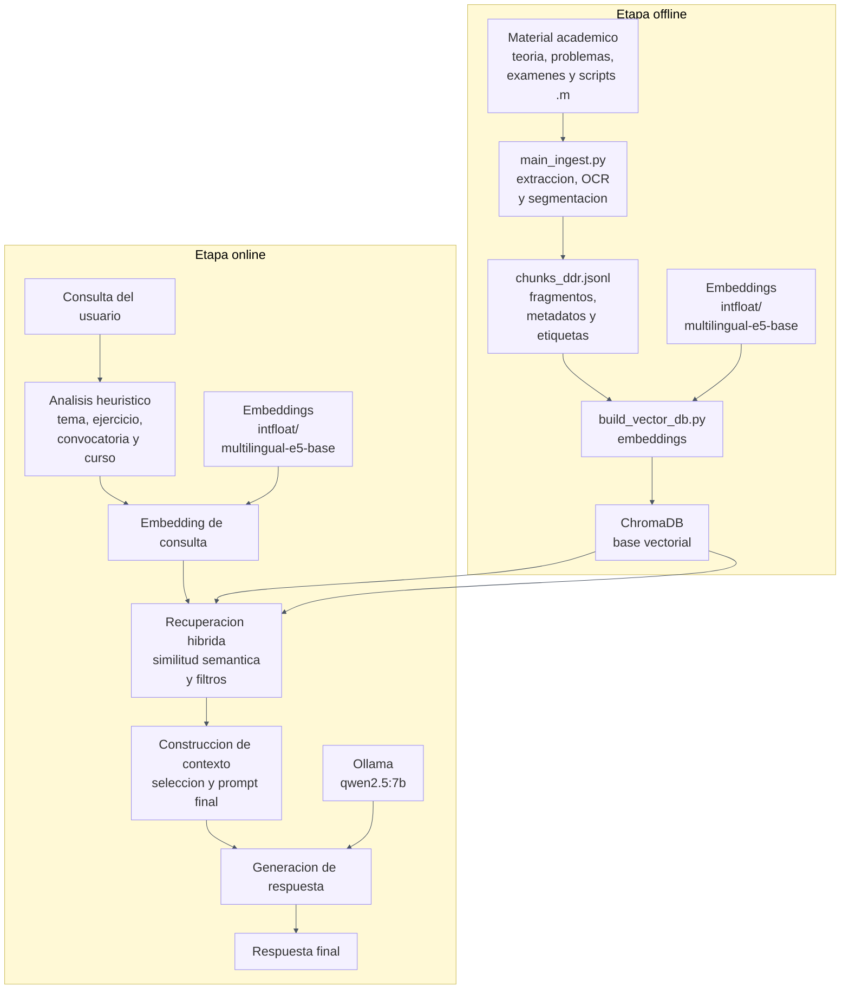

```mermaid
%%{init: {'theme': 'base', 'themeVariables': {
  'fontSize': '22px',
  'fontFamily': 'Arial',
  'primaryColor': '#f4f1ff',
  'primaryBorderColor': '#9a8df0',
  'lineColor': '#4b5563',
  'clusterBkg': '#fff9d6',
  'clusterBorder': '#cdbf63'
}}}%%
flowchart TB

%% =========================
%% BLOQUE 1 - ETAPA OFFLINE
%% =========================
subgraph OFF["Etapa offline"]
direction TB

DOCS["Material academico<br/>teoria, problemas,<br/>examenes y scripts .m"]
INGEST["main_ingest.py<br/>extraccion, OCR<br/>y segmentacion"]
CHUNKS["chunks_ddr.jsonl<br/>fragmentos,<br/>metadatos y etiquetas"]
EMB["build_vector_db.py<br/>embeddings"]
DB["ChromaDB<br/>base vectorial"]
MODEL_E["Embeddings<br/>intfloat/<br/>multilingual-e5-base"]

DOCS --> INGEST
INGEST --> CHUNKS
CHUNKS --> EMB
MODEL_E --> EMB
EMB --> DB
end

%% =========================
%% BLOQUE 2 - ETAPA ONLINE
%% =========================
subgraph ON["Etapa online"]
direction TB

Q["Consulta del usuario"]
AN["Analisis heuristico<br/>tema, ejercicio,<br/>convocatoria y curso"]
QEMB["Embedding de consulta"]
RET["Recuperacion hibrida<br/>similitud semantica<br/>y filtros"]
CTX["Construccion de contexto<br/>seleccion y prompt final"]
GEN["Generacion de respuesta"]
ANS["Respuesta final"]
MODEL_E2["Embeddings<br/>intfloat/<br/>multilingual-e5-base"]
LLM["Ollama<br/>qwen2.5:7b"]

Q --> AN
AN --> QEMB
MODEL_E2 --> QEMB
QEMB --> RET
DB --> RET
RET --> CTX
CTX --> GEN
LLM --> GEN
GEN --> ANS
end

DB --> RET
```
